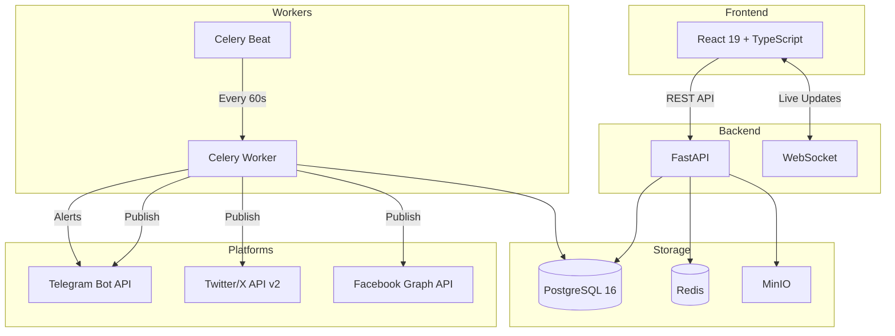
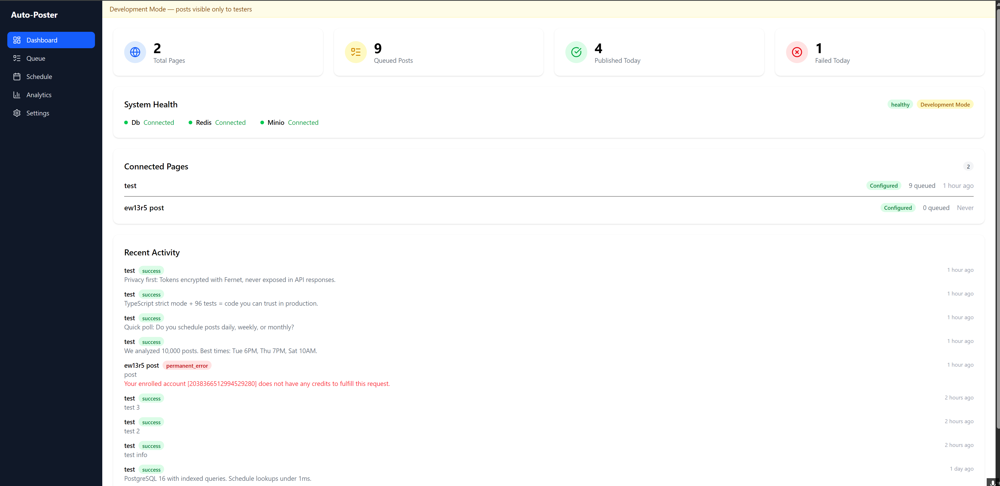
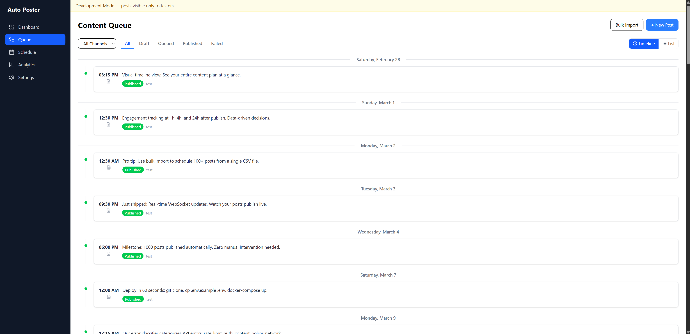
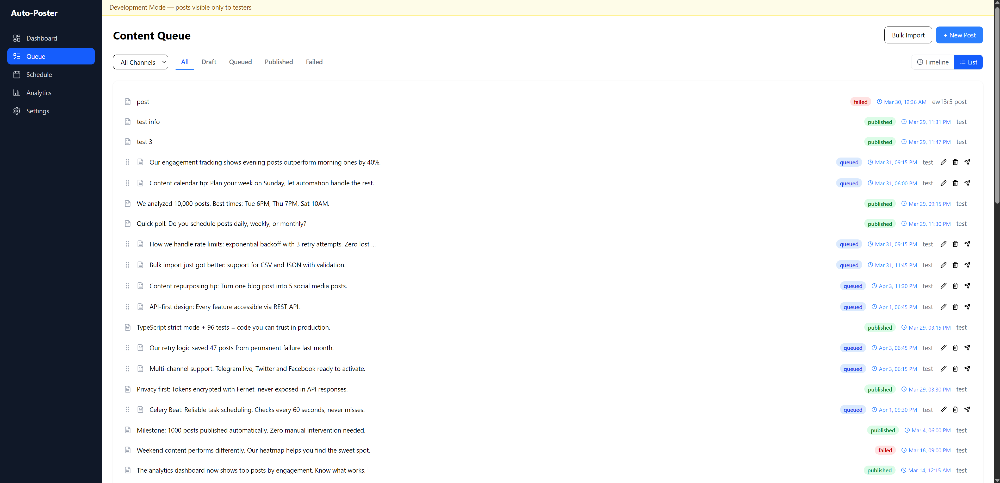
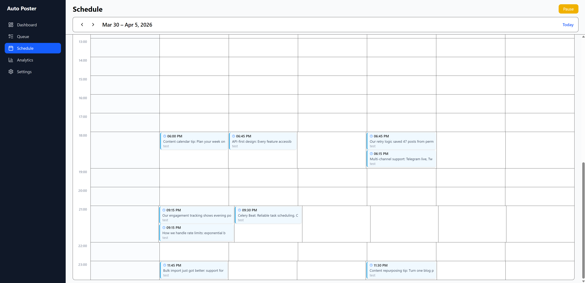
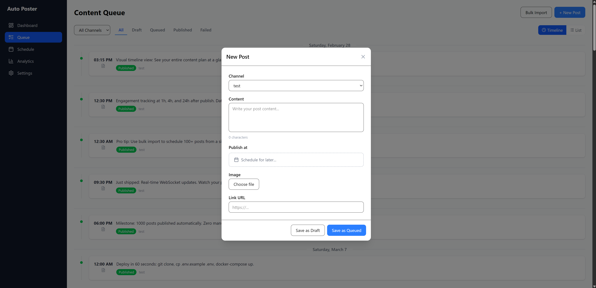
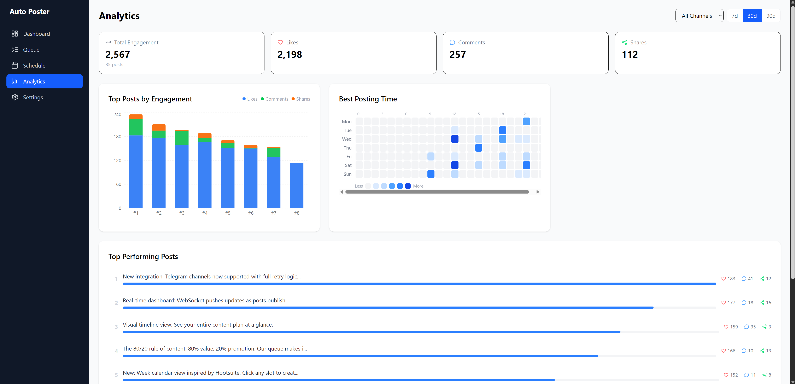
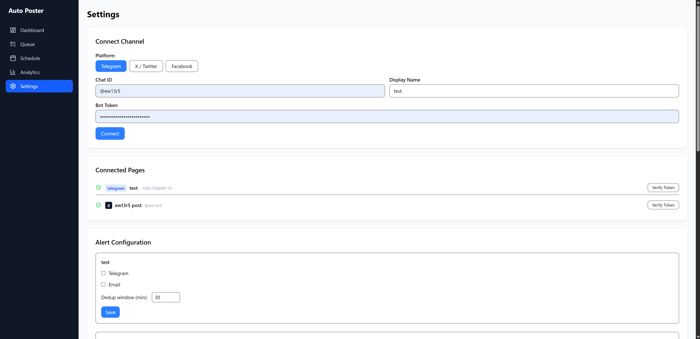
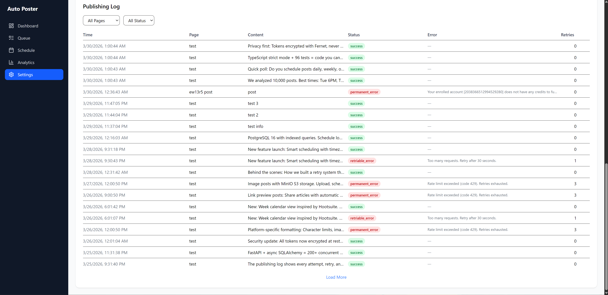

# Auto Poster — Automated Social Media Publishing System

> Set-and-forget content publishing across multiple platforms with smart scheduling, retry logic, and engagement tracking.


## The Problem

Content managers juggle multiple platforms, manually posting at optimal times, missing slots on evenings and weekends, losing posts to API failures with no retry, and never knowing what actually performed.

## The Solution

Auto Poster automates the entire workflow: queue your content, set your schedule, and the system handles publishing, retries, and tracking 24/7.

## Key Features

- **Visual Schedule Calendar** — Hootsuite-style week view, click to create/edit posts, current time indicator
- **Smart Queue** — Drag-and-drop ordering, timeline and list views, status filtering
- **Automated Publishing** — Celery Beat checks every 60 seconds, publishes on schedule
- **Per-Post Scheduling** — Set exact date and time with custom picker (quick presets, timezone display)
- **Retry Logic** — 3 attempts with exponential backoff on retriable API errors
- **Error Spike Protection** — Auto-pauses channel after 3 consecutive failures
- **Engagement Tracking** — Auto-fetches likes/comments/shares at 1h, 4h, 24h after publish
- **Best Time Heatmap** — Discover optimal posting times from your data
- **Multi-Platform** — Telegram (live), Twitter/X, Facebook (architecture ready)
- **Bulk Import** — Upload CSV/JSON with 100+ posts at once
- **Alerts** — Telegram + email notifications on failures
- **Token Security** — Fernet encryption with key rotation
- **One-Command Deploy** — `docker compose up` starts all 7 services

## Architecture



## Screenshots

> **Note:** Analytics data shown in screenshots is generated by a seed script for demonstration purposes. The engagement numbers, heatmap patterns, and post statistics are illustrative — real data populates as you publish and track posts through the system.

| Dashboard | Queue (Timeline) | Queue (List) |
|:---------:|:----------------:|:------------:|
|  |  |  |

| Schedule Calendar | Post Editor | Analytics |
|:-----------------:|:-----------:|:---------:|
|  |  |  |

| Settings | Publishing Log |
|:--------:|:--------------:|
|  |  |

## Quick Start

### Prerequisites
- Docker and Docker Compose
- Git

### Setup

```bash
git clone https://github.com/yourusername/auto-poster.git
cd auto-poster

# Create environment file
cp .env.example .env

# Generate security keys
python -c "from cryptography.fernet import Fernet; print(f'FERNET_KEYS={Fernet.generate_key().decode()}')" >> .env
python -c "import secrets; print(f'API_KEY={secrets.token_urlsafe(32)}')" >> .env

# Start all services
docker compose up -d

# Open http://localhost:3001
```

### Connect a Channel

1. Go to **Settings** → **Connect Channel**
2. Select platform (Telegram, Twitter/X, or Facebook)
3. Enter credentials and connect
4. Create posts in **Queue**, set schedule in **Schedule**

### Telegram Setup (Recommended for Testing)

1. Message [@BotFather](https://t.me/BotFather) on Telegram → `/newbot`
2. Create a channel, add your bot as admin
3. In Settings, select Telegram, enter Chat ID and Bot Token
4. Create a post → Schedule → watch it publish automatically

## Supported Platforms

| Platform | Integration | Auth Method | Status |
|----------|------------|-------------|--------|
| Telegram | Bot API (sendMessage, sendPhoto) | Bot Token | Live & Tested |
| Twitter/X | API v2 (POST /2/tweets) | OAuth 1.0a HMAC-SHA1 | Implemented (requires paid API plan) |
| Facebook | Graph API (feed, photos) | OAuth 2.0 + Page Token | Implemented (requires Meta developer account) |

Adding a new platform requires implementing one async publisher function — typically 100-150 lines of code. The architecture supports any platform with a REST API.

## Database Schema

| Table | Purpose |
|-------|---------|
| `pages` | Connected channels with platform, encrypted tokens |
| `posts` | Content, status, scheduled_at, order_index |
| `schedule_slots` | Recurring weekly time slots |
| `publish_log` | Every publish attempt with result/error |
| `alert_log` | Alert history |
| `engagements` | Post engagement metrics (likes, comments, shares) |

## API Endpoints

| Method | Endpoint | Description |
|--------|----------|-------------|
| GET | `/api/health` | System health with DB/Redis/MinIO checks |
| GET | `/api/pages` | List connected channels |
| POST | `/api/pages/connect` | Connect a new channel |
| GET | `/api/posts` | List posts with filters |
| POST | `/api/posts` | Create a post |
| PUT | `/api/posts/:id` | Update a post |
| DELETE | `/api/posts/:id` | Delete a post |
| POST | `/api/posts/:id/publish-now` | Publish immediately |
| PUT | `/api/posts/reorder` | Reorder queue |
| POST | `/api/posts/bulk` | Bulk import (CSV/JSON) |
| GET | `/api/schedule` | Get schedule slots |
| PUT | `/api/schedule` | Update schedule |
| POST | `/api/schedule/pause` | Pause/resume publishing |
| GET | `/api/analytics/engagement` | Engagement data |
| GET | `/api/analytics/best-time` | Best posting time heatmap |
| GET | `/api/log` | Publishing log |
| GET/PUT | `/api/alerts/config` | Alert configuration |
| WS | `/ws` | WebSocket live updates |

## Docker Services

| Container | Port | Role |
|-----------|------|------|
| autoposter-api | 8000 | FastAPI with auto-reload |
| autoposter-frontend | 3001 | Nginx + React SPA |
| autoposter-worker | — | Celery worker (2 concurrency) |
| autoposter-beat | — | Celery beat scheduler |
| autoposter-postgres | 5432 | PostgreSQL 16 |
| autoposter-redis | 6379 | Redis 7 (broker + cache) |
| autoposter-minio | 9000/9001 | MinIO (S3 image storage) |

## Testing

```bash
cd frontend
npm run test        # 96 tests
npx tsc --noEmit    # TypeScript strict mode, 0 errors
```

## Tech Stack

- **Frontend**: React 19, TypeScript (strict), Tailwind CSS v4, Vite 8, vitest
- **Backend**: FastAPI, async SQLAlchemy, Alembic migrations
- **Database**: PostgreSQL 16 with indexed queries
- **Queue**: Celery + Redis (broker + result backend)
- **Storage**: MinIO (S3-compatible, for images)
- **Security**: Fernet encryption (MultiFernet with key rotation)
- **Real-time**: WebSocket (native FastAPI)
- **Deploy**: Docker Compose (7 containers)

## License

MIT
